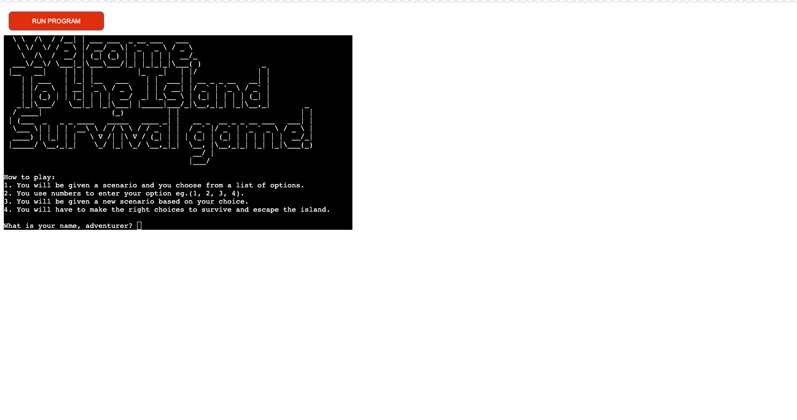
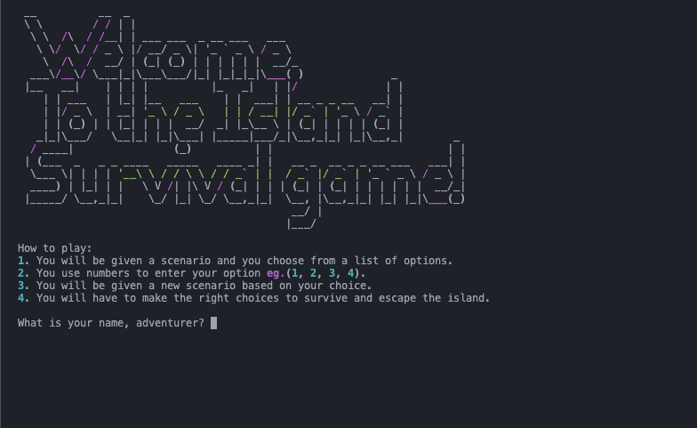
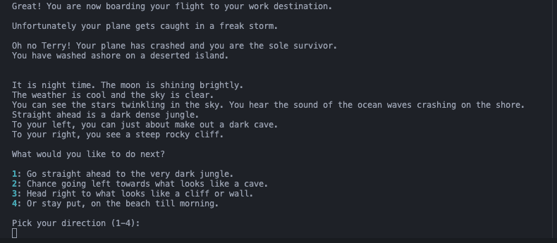
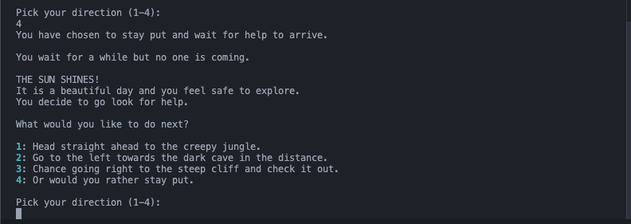
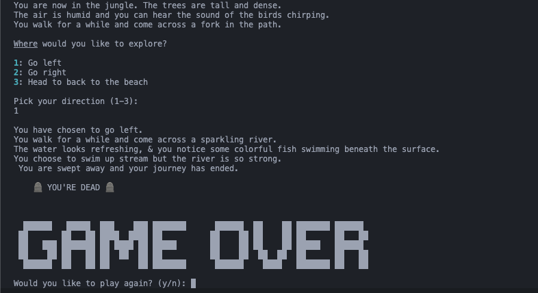
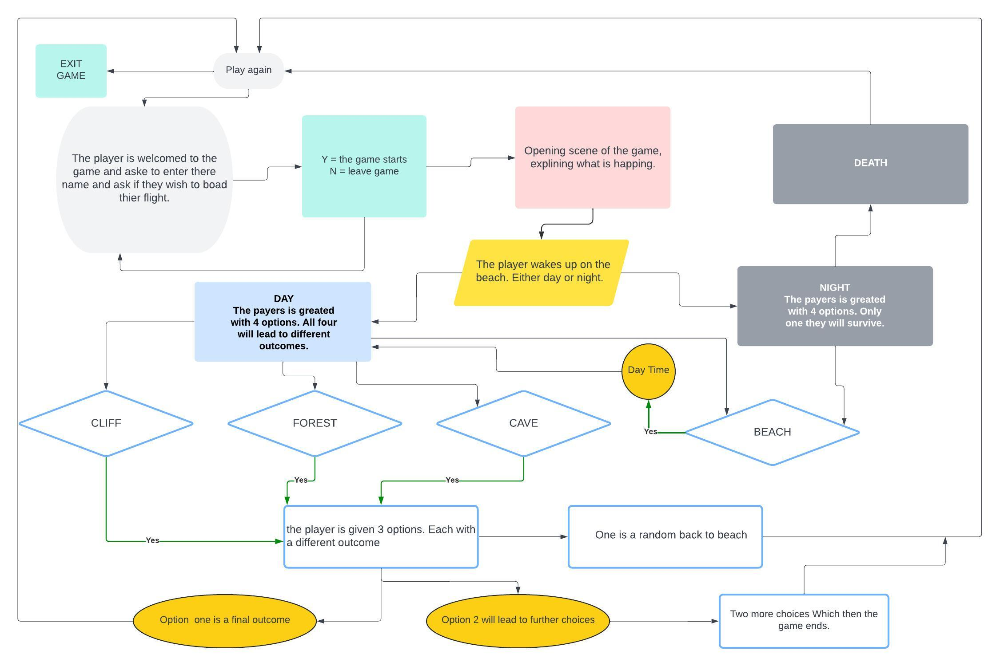
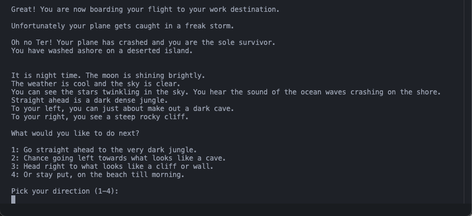
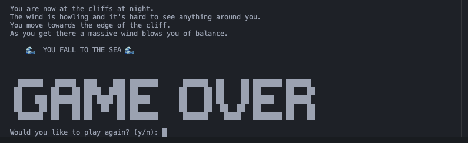

```plaintext
   __        __        __      __        __               __     
| [__  |    |__| |\ | |  \    [__  |  | |__/ |  | | |  | |__| |    
| ___] |___ |  | | \| |__/    ___] |__| |  \  \/  |  \/  |  | |___
```                    

Welcome to the **Island Survival Game**, a text-based adventure where you must survive and escape.

Live link: [Island Survival Game](https://island-survival-game-677f52a3b93d.herokuapp.com/)




## Table of Contents

- [Introduction](#introduction)
- [How to Play](#how-to-play)
- [Game Structure](#game-structure)
- [Libraries, Technologies and Tools](#libraries-technologies-and-tools)
- [Testing](#testing)

## [Introduction](#introduction)

The **Island Survival Game** is a text-based adventure game where you must make the right choices to survive on a deserted island. Your choices will determine your fate, so choose wisely! The game is built with Python and is played in the terminal.

### Target Audience
The game is suitable for anyone who enjoys text-based adventure games and wants to test their decision-making skills. It's a fun and interactive way to experience a survival scenario and see if you can make it out alive.

#### User Stories
1. As a player, I want to be able to make choices that affect the outcome of the game.
2. As a player, I want to experience different scenarios based on my choices.
3. As a player, I want to be able to play the game multiple times with different outcomes.

## [How to Play](#how-to-play)

To play the **Island Survival Game**, follow these steps: 
It is a simple game that can be played by anyone. I wanted to create a game that was easy to play and understand.

The game is built with a multiple-choice format:
1. You will be given a scenario and you choose from a list of options.
2. Use numbers to enter your option (e.g., 1, 2, 3, 4).
3. You will be presented with a new scenario based on your choice.
4. Make the right choices to survive and escape the island.

### Game layout

The game is structured as follows:

1. Welcome message and game rules where the user is prompted to enter their name and asked if they are ready to board the plane.



<br>

2. The game starts with the plane crashing and you being stranded on an island. You will be presented with the first event scenario. The time of day will determine on the random library used in the first_event() function. Here they can choose to explore the island or stay put.



<br>

3. Based on your choice, you will be presented with the second event scenario. Unless it was night time, you will be presented with the choices to explore the island or stay put. If you choose to explore at night instead of staying put you will lose...



<br>

4. After playing through the game you will be presented with the option to play again or exit the game. This will loop back to the start of the game. If you choose to exit the game you will be presented with a goodbye message.




## [Game Structure](#game-structure)

### Flowchart
Here is the flowchart of the game structure:



<br>

The game is built with a modular structure to handle different scenarios and outcomes. Here's an overview of all the functions in the game:

### Main Functions
1.  **print_welcome_message()**: Displays the welcome message and game rules.
2.  **get_user_name()**: Prompts the user for their name and initiates the boarding process.
3.  **initiate_boarding(user_name)**: Handles the boarding process and starts the first event.
4.  **exit_game()**: Exit the game with a goodbye message if player does not board the plane.
5.  **play_again()**: Prompts the user to play again or exit the game.
6.  **get_numeric_choice(prompt)**: Prompts the user for a numeric input and validates it.
7.  **first_event()**: Determines the time of day and presents the first event scenario.
8.  **second_event(day_night)**: Presents the second event scenario based on the user's choice.
9.  **handle_scenarios(day_night, user_choice, movements)**: Handles scenarios based on the user's choice.
10. **beach()**: Handles the random outcome on returning to the beach.
11. **choices(day_info, print_choices)**: Prints the choices based on it being daytime.
12. **choices_outcomes(day_info, print_choices)**: Prints the choices based on the outcome decision of the user.
13. **handle_stay_put_scenario()**: Handles the scenario when the user chooses to stay put.
14. **main()**: The main function to start the game.

#### Sample Code
Here’s a snippet of the main game loop:

            def main():
                """Main function to start the game."""
                print_welcome_message()

            if __name__ == "__main__":
                main()

### Example of the Game
After starting the game, you'll be asked for your name and whether you're ready to board the plane.
If you choose to board, the adventure begins with the plane crashing and you being stranded on an island.
You'll be presented with various scenarios and must choose your actions wisely to survive.

#### User Options
The game provides the user with a list of options to choose from. Here are some examples:


#### Game Over
If you make the wrong choices, you may face a game over scenario. Here's an example:


### Time breaks 
To ensure better user experience, the game us the time library. This allows the game to load the next scene with a bit of anticipation, and ensures a better flow and readability.

### Images and Scenes
The game uses these two modules (images.py & scenes.py) to get the information needed to display the outcome of the users choices.

## [Libraries, Technologies and Tools](#libraries-technologies-and-tools)

### Languages:
The primary language used to build this project is [Python](https://www.python.org/) with version 3.9.6.<br>
The Readme is written in [Markdown](https://www.markdownguide.org/).

### Libraries:
- [Random](https://docs.python.org/3/library/random.html): Used to generate random scenarios.
- [Time](https://docs.python.org/3/library/time.html): Used to add time breaks between scenes.
- [rich](https://rich.readthedocs.io/en/latest/): Add color and style to the terminal output.

### Technologies and Tools:
- [Visual Studio Code](https://code.visualstudio.com/): The code editor used to write my Python code.
- [GitHub](https://github.com/) and [Git](https://git-scm.com/): Used for version control and to host the repository.
- [Heroku](https://www.heroku.com/): Used to deploy the game online.
- [Lucidchart](https://www.lucidchart.com/): Where I created the flowchart for the game progression.
- [ASCII Art Generator](https://patorjk.com/software/taag/#p=display&f=Big&t=Island%20Survival%20Game): Used to generate the ASCII art used in images.py.
- [CI Python Linter](https://pep8ci.herokuapp.com/#): To validate and check my code for best code practices.


