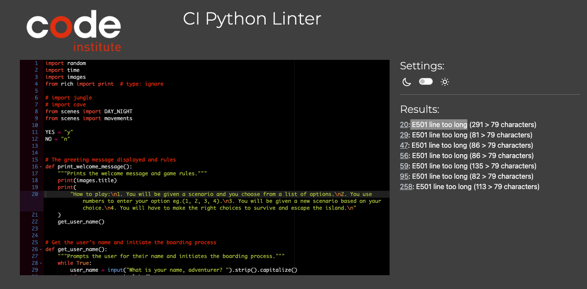
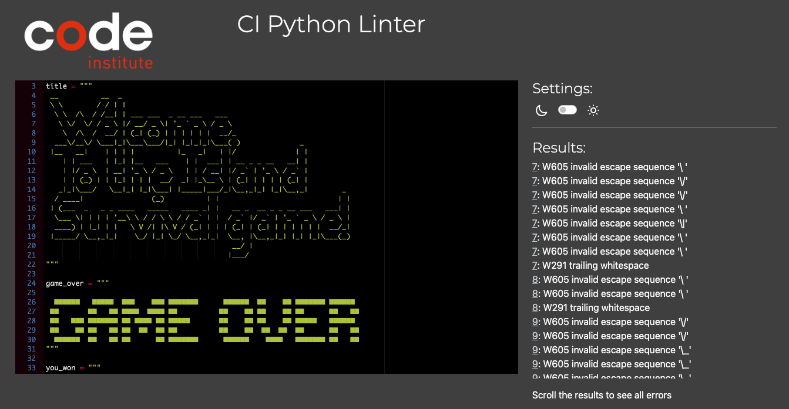
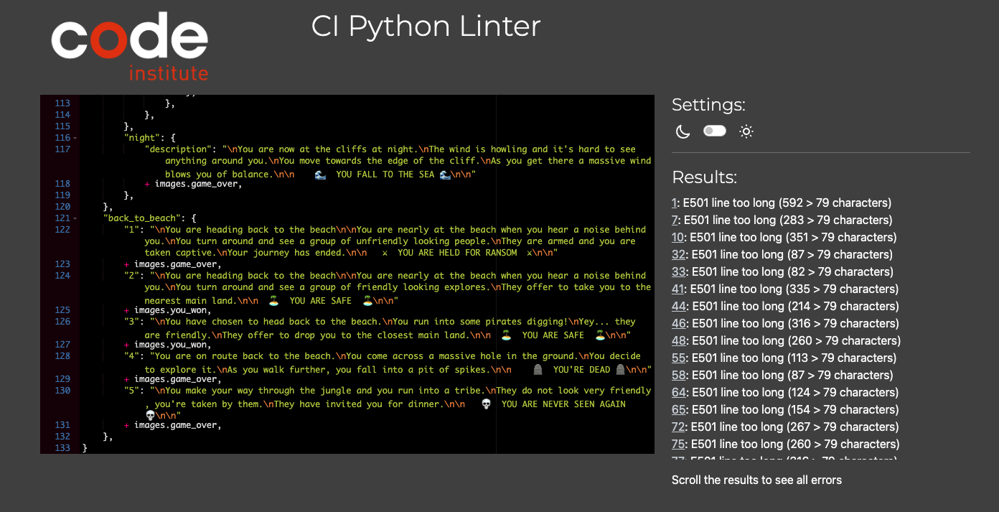
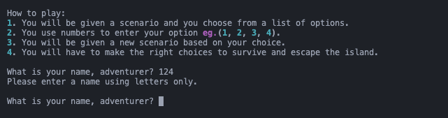
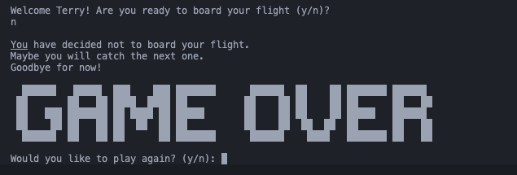
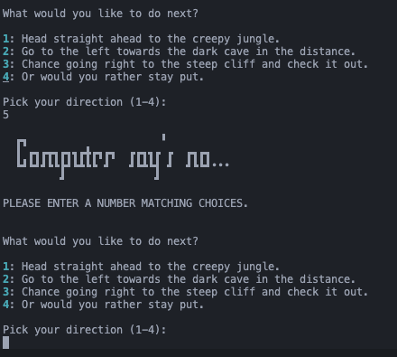
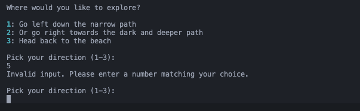
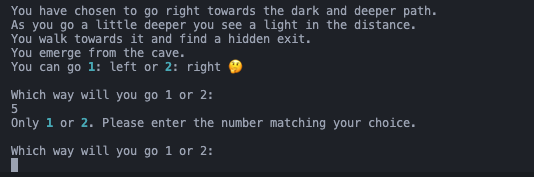

####   [Table of Contents](#table-of-contents)

- [Testing for the project](#testing-for-the-project)
  - [Code Test](#code-test)
    - [Code Validation with PEP8](#code-validation-with-pep8)
    - [Bugs](#bugs)
  - [Gameplay Test](#gameplay-test)
    - [Testing the Game](#testing-the-game)
    - [Manual Testing](#manual-testing)
  - [User Stories Testing](#user-stories-testing)
  

Return to [Readme.md](README.md)
  
 

# [Testing for the project](#testing-for-the-project)

Here is the testing for the project to ensure that the game is working as expected.
The testing is divided into two parts: testing the code and testing the gameplay.

## [Code Test](#code-test)

### [Code Validation with PEP8](#code-validation-with-pep8)

The Python code was validated and tested using the [PEP8 Linter validator](https://pep8ci.herokuapp.com/#).

1. Testing run.py file, the following errors were found:

2. Testing images.py file, the following errors were found:

3. Testing scenes.py file, the following errors were found:

### [Bugs](#bugs)

The following bugs were not fixed as they did not effect the gameplay or progress of the program.

Here is the list of the errors:
1. E501 line too long **(on a all the files)**
2. W605 invalid escape sequence **(on images.py)**
3. W291 trailing whitespace **(on images.py)**
4. w293 blank line contains whitespace **(on images.py)**

## [Gameplay Test](#gameplay-test)

In this section, the gameplay was tested to ensure that the game is working as expected. The user was able to play the game without any issues and if there were any issues, they were fixed.

### [Testing the Game](#testing-the-game)

There are is one input throughout the application, therefore, validating the input was crucial for the functionality of the application.

Each input was tested during and after the development the game. The screenshots display all viable entries and responses to incorrect data:

1. The user is asked to enter their name: If the user enters numbers or blank space they will be re-promoted.

 

2. The user is asked board the plane: If no is entered, the game will end & promote them to play again.
   

 

3. The user is asked where to explore first: If the user enters a number that is not in the list, they will be re-promoted and shown an image to cement in that it is only the numbers available.
   

 

4. The user is asked to enter the number of the direction they want to explore: If the user enters a number that is not in the list, they will be re-promoted.

 

All the inputs were tested to ensure that the user can only enter the correct input and if they enter the wrong input, they will be re-promoted to enter the correct input. The game was tested multiple times to ensure that the user can play the game without any issues.

### [Manual Testing](#manual-testing)

| Feature                                  | Test         | Outcome                                           | Pass/Fail |
| ---------------------------------------- | ------------ | ------------------------------------------------- | --------- |
| The player can enter their name          | Enter a name | The name is stored and used throughout the game.  | Pass      |
| The player can choose to board the plane | Enter y      | If yes, the game continues.                       | Pass      |
| The player can choose to board the plane | Enter n      | If no, the game ends & asks the user to play.     | Pass      |
| The player arrives night                 | pick 1 - 3   | The user dies and is prompted to play again.      | Pass      |
| The player arrives night                 | picks 4      | The user lives and the game moves on.             | Pass      |
| The player can choose to explore         | 1 - 4        | If the number is on the list, the game continues. | Pass      |
| The player can choose to explore         | 1 - 4        | If the number is not in the list, re-promoted.    | Pass      |
| The player can pick a direction          | 1 - 3        | If the number is on the list, the game continues. | Pass      |
| The player can pick a direction          | 1 - 3        | If the number is not in the list, re-promoted.    | Pass      |
| The game ends                            | Win / lose   | The user to play again or exit.                   | Pass      |

## [User Stories Testing](#user-stories-testing)

I tested that I fulfilled the user stories by playing the game and ensuring that the user can play the game to the standard that was set out to achieve.

| User Story                                                                 | Completed | Additional Comments |
| -------------------------------------------------------------------------- | --------- | ------------------- |
| I want to be able to make choices that affect the outcome of the game.     | Yes       | You live or Die     |
| I want to experience different scenarios based on my choices.              | Yes       | Different locations |
| I want to be able to play the game multiple times with different outcomes. | Yes       | Multiple choice     |

Return to [Table of Contents](#table-of-contents)

