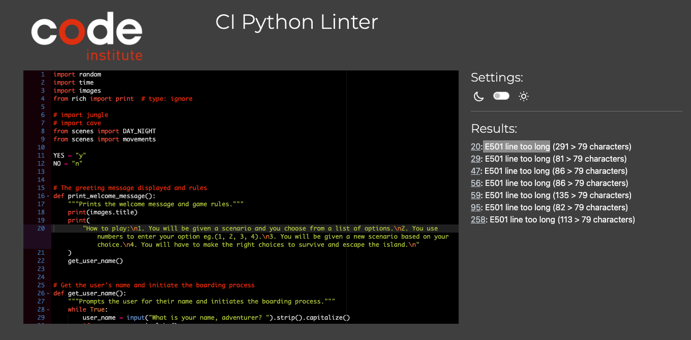
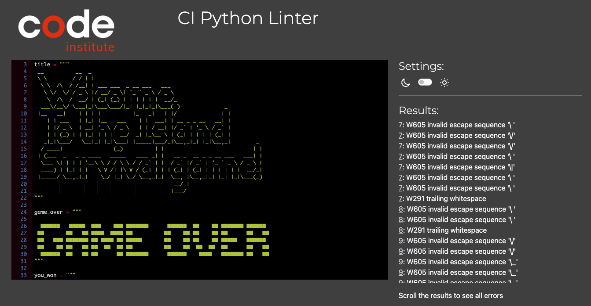
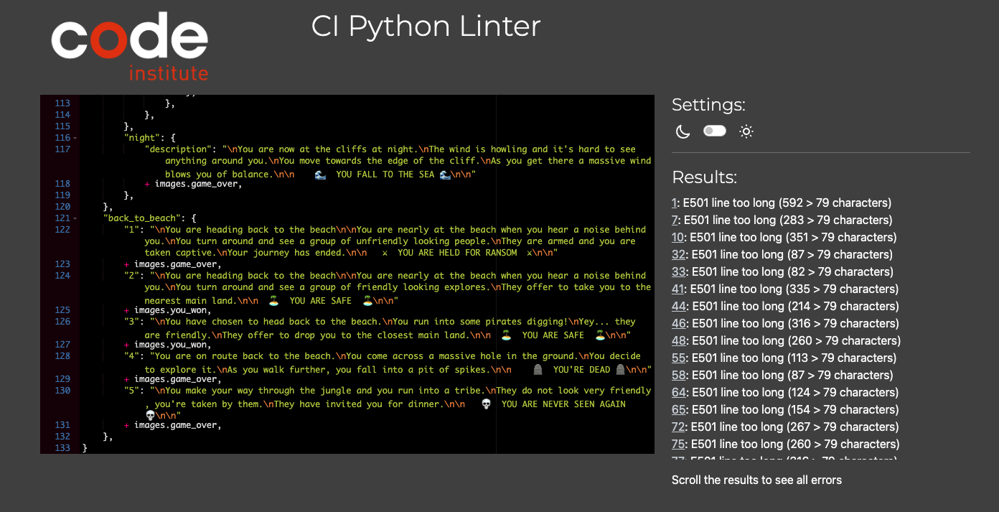

# Testing for the project

Here is the testing for the project to ensure that the game is working as expected.
The testing is divided into two parts: testing the code and testing the gameplay.

## Code Test

### Code Validation with PEP8

The Python code was validated and tested using the [PEP8 Linter validator](https://pep8ci.herokuapp.com/#).

1. Testing run.py file, the following errors were found:

2. Testing images.py file, the following errors were found:

3. Testing scenes.py file, the following errors were found:

### Bugs

The following bugs were not fixed as they did not effect the gameplay or progress of the program.

Here is the list of the errors:
1. E501 line too long **(on a all the files)**
2. W605 invalid escape sequence **(on images.py)**
3. W291 trailing whitespace **(on images.py)**
4. w293 blank line contains whitespace **(on images.py)**

## Gameplay Test

In this section, the gameplay was tested to ensure that the game is working as expected. The user was able to play the game without any issues and if there were any issues, they were fixed.

### Testing the Game

There are is one input throughout the application, therefore, validating the input was crucial for the functionality of the application.

Each input was tested during and after the development the game.

The screenshots display all viable entries and responses to incorrect data:

